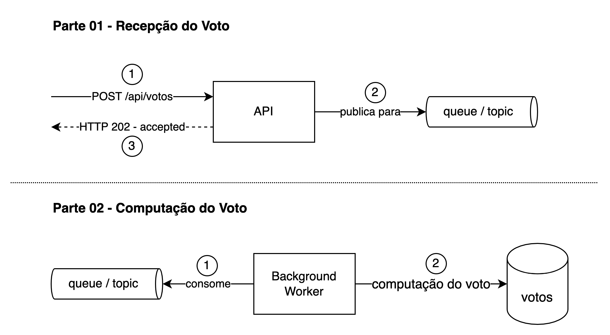

  <h1>Simulando o sistema de votacao do Big Brother Brasil. =)</h1>
  
Confira no final do readme como rodar o projeto.

  

  <h1>Fluxo da aplicacao</h1>
  

### :rocket: Tecnologias

- RabbitMQ
- HTTP
- Next.js
- Typescript
- Laravel/PHP
- Nodejs

    <h1>Para rodar a aplicacao sera necessario voce clonar o repositorio e seguir estes passos abaixo.</h1>
  
Antes de tudo, voce vai precisar do docker, depois de instalar suba esses 2 containers
  
   - docker run --name bbb_db -e MYSQL_ROOT_PASSWORD=root -p 3306:3306 -d mysql:5.7  
   - docker run -p 15672:15672 -p 5672:5672 rabbitmq:3-management    
    1 - Acesse a pasta laravel-producer e digite no terminal: php artisan migrate  
    2 - Ainda na pasta do laravel, agora digite: php -S localhost:8000 -t public  
    3 - Crie um cluster gratuito no Mongodb Atlas, adicione seu IP na whitelist e configure o seu banco e coloque a url do mesmo no arquivo consumer.js na variavel url. tutorial aqui: https://dev.to/dalalrohit/how-to-connect-to-mongodb-atlas-using-node-js-k9i 
    4 - Ainda na pasta do node digite no terminal: node src/consumer.js 
    5 - Acesse a pasta client e digite: yarn dev 

